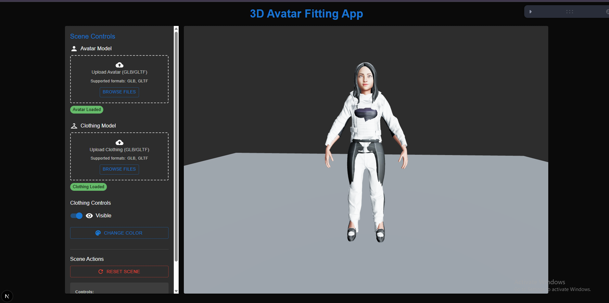

# 3D Avatar Fitting App

A production-ready web application that allows users to upload 3D avatar models and fit clothing onto them using Three.js and React. Features automatic scene state persistence, mobile-responsive design, and robust error handling.



📹 **Demo Video**: [Watch on Loom](https://www.loom.com/share/15e15cd4f6fb467592477eb4ce8a2f4c?sid=c08272ff-b0fd-4715-9128-5deb9e8118e2)

## ✨ Features

### Core Functionality

- **3D Model Upload**: Support for GLB/GLTF avatar and clothing models with drag & drop
- **Interactive 3D Scene**: Smooth zoom, rotate, and pan controls with OrbitControls
- **Auto-fitting**: Basic automatic clothing fitting to avatar proportions
- **Clothing Controls**: Toggle visibility and change colors with real-time updates
- **Scene Persistence**: Automatic backend storage and restoration of scene state
- **Session Management**: Unique session tracking for better state management

### User Experience

- **Mobile Responsive**: Optimized interface for desktop, tablet, and mobile devices
- **Dark Theme**: Modern dark UI with Material Design components
- **Real-time Notifications**: Success/error feedback for all operations
- **Loading States**: Visual feedback during uploads and processing
- **Error Recovery**: Graceful handling of network failures and file errors

### Production Features

- **File System Compatibility**: Works in serverless environments (Vercel, Netlify)
- **Automatic Cleanup**: Periodic cleanup of temporary files to prevent storage bloat
- **Security**: File validation, path traversal protection, and size limits

## 🛠 Tech Stack

### Frontend

- **Framework**: Next.js 14 with App Router
- **UI Library**: React 18 with TypeScript
- **3D Graphics**: Three.js with React Three Fiber and Drei
- **UI Components**: Material-UI (MUI) v5
- **Styling**: Material-UI theming system

### Backend

- **Runtime**: Next.js API Routes with Node.js
- **File Storage**: File system with production-ready `/tmp` directory support
- **File Processing**: Native FormData handling with fs-extra
- **Session Management**: UUID-based session tracking

### Development

- **Language**: TypeScript for type safety
- **Package Manager**: npm
- **Development Server**: Next.js dev server with hot reload

## 📦 Installation

### Prerequisites

- Node.js 18+
- npm or yarn package manager

### Local Development Setup

1. **Clone the repository**

   ```bash
   git clone <your-repo-url>
   cd 3d-avatar-fitting-app
   ```

2. **Install dependencies**

   ```bash
   npm install
   ```

3. **Create required directories** (for development)

   ```bash
   mkdir -p public/uploads data
   ```

4. **Run the development server**

   ```bash
   npm run dev
   ```

5. **Open your browser**
   Navigate to [http://localhost:3000](http://localhost:3000)

### Production Deployment

#### Vercel (Recommended)

1. **Deploy to Vercel**

   ```bash
   npm install -g vercel
   vercel --prod
   ```

2. **Environment Configuration**
   - No additional environment variables required
   - Automatic `/tmp` directory usage in production
   - Built-in file cleanup mechanisms

## 🎮 Usage

### Basic Workflow

1. **Upload Avatar Model**

   - Click the "Upload Avatar" button or drag a GLB/GLTF file
   - Wait for the upload and processing to complete
   - Avatar will appear centered in the 3D scene

2. **Upload Clothing Model**

   - Once avatar is loaded, upload a clothing model
   - Clothing will automatically position relative to the avatar
   - Use controls to adjust visibility and appearance

3. **Navigate the 3D Scene**

   - **Left click + drag**: Rotate camera around the model
   - **Right click + drag**: Pan camera position
   - **Scroll wheel**: Zoom in/out
   - **Double click**: Reset camera position

4. **Customize Appearance**
   - **Toggle Clothing**: Show/hide clothing with the visibility button
   - **Change Colors**: Use the color picker to modify clothing colors
   - **Real-time Updates**: Changes apply immediately to the 3D scene

## 📋 File Requirements

### Supported Formats

- **3D Models**: GLB (recommended), GLTF
- **File Size**: Maximum 100MB per file
- **Upload Method**: Direct upload or drag & drop

## 🔧 API Endpoints

### File Upload

- **POST** `/api/upload` - Upload GLB/GLTF models
- **GET** `/api/files/[filename]` - Serve uploaded files (production)

### Scene State Management

- **GET** `/api/scene-state` - Retrieve current scene state
- **POST** `/api/scene-state` - Save scene state
- **DELETE** `/api/scene-state` - Clear scene state

## 🏗 Architecture

### File Storage Strategy

- **Development**: Local `public/uploads` and `data` directories
- **Production**: `/tmp` directory with automatic cleanup
- **File Serving**: Dynamic file serving via API routes in production

### State Management

- **Frontend**: React state with automatic persistence
- **Backend**: JSON file storage with session tracking
- **Synchronization**: Real-time sync between UI and backend

## 🚀 Performance Optimizations

- **File Cleanup**: Automatic removal of old temporary files
- **Lazy Loading**: 3D models load on demand
- **Responsive Images**: Optimized loading states and placeholders
- **Memory Management**: Proper disposal of 3D resources
- **Caching**: Browser caching for uploaded models

### Common Issues

**Models not loading**

- Check file format (GLB/GLTF only)
- Verify file size is under 100MB
- Ensure model is properly exported
